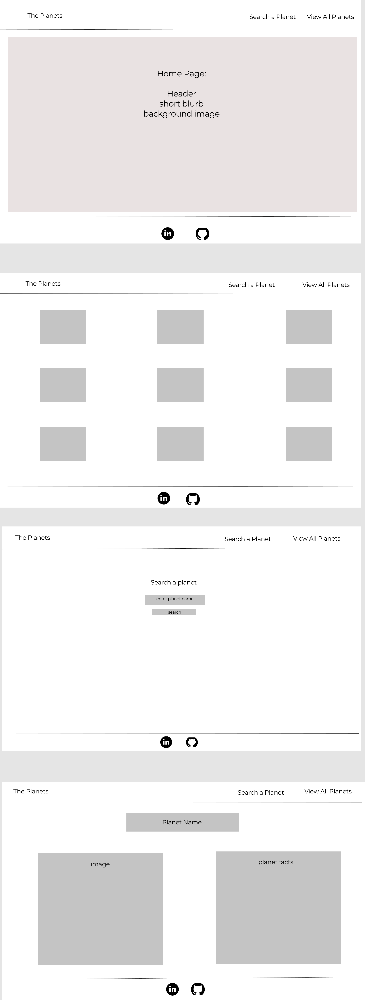
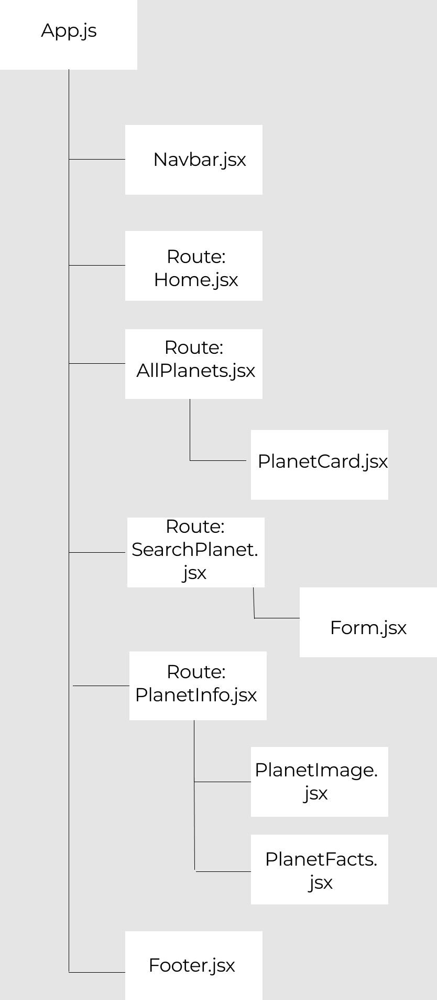

# the-planets

## Project Name
<h3>The Planets</h3>

## Project Description

Vistors will be able to search and find information on the planets in our solar system. Space and the planets are a fascinating aspect to think about, but a lot of the time the information is very hard to understand. The goal of this app is to provide information in layman's terms to accommodate everyone. 

## Wireframes

## Component Hierarchy

## API

I will be using the API and airtable to pull in inforamtion on planets that I entered in.

